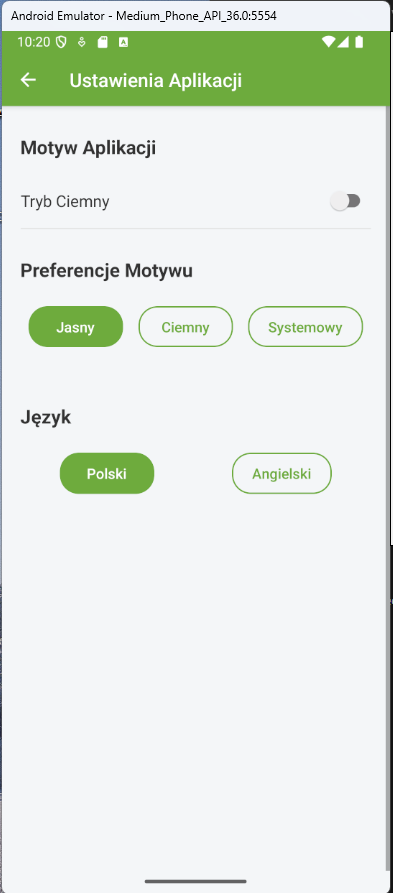
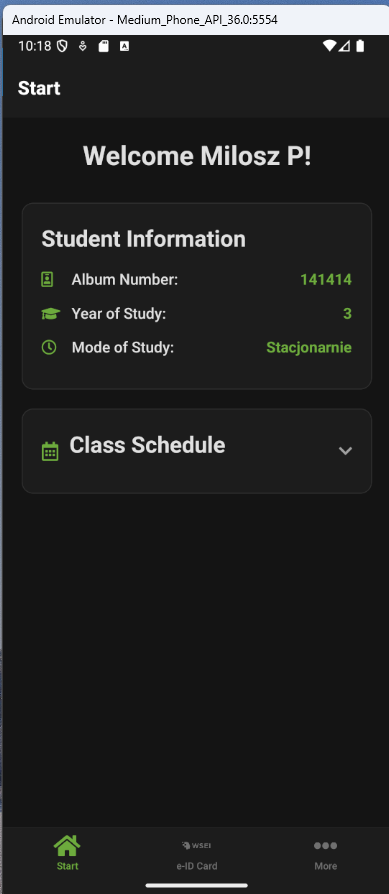
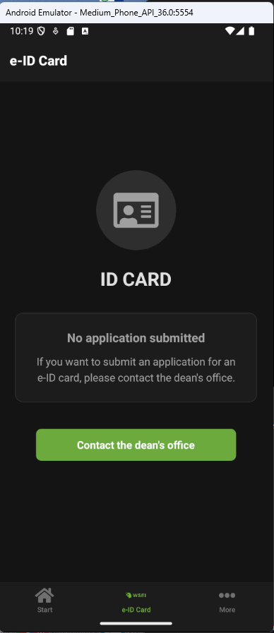
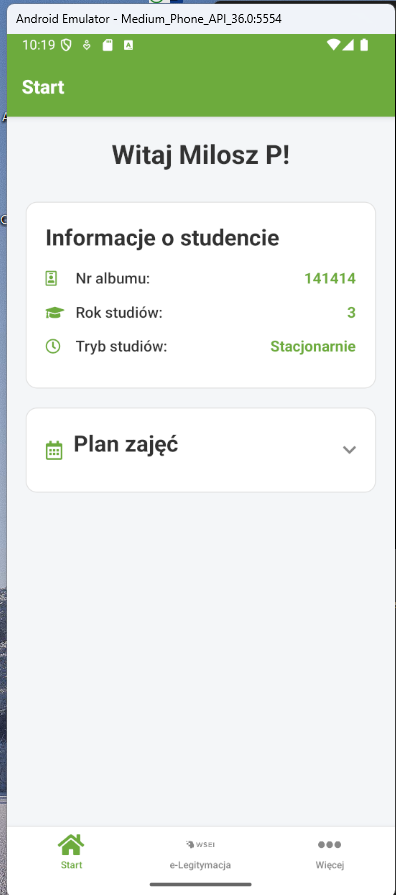
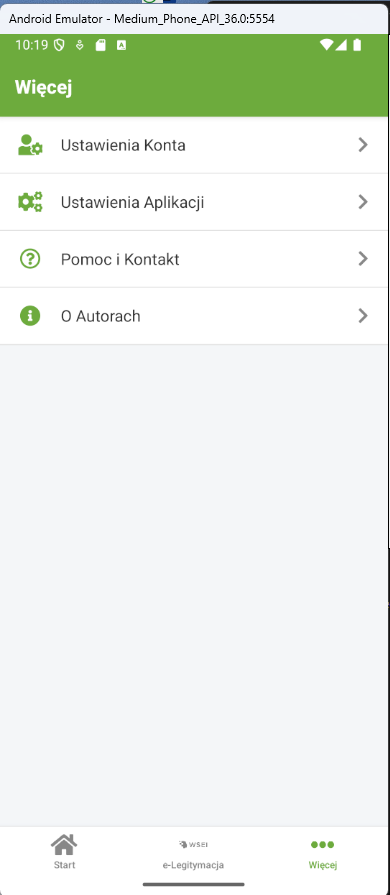
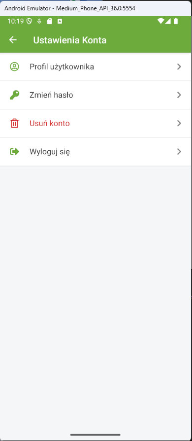
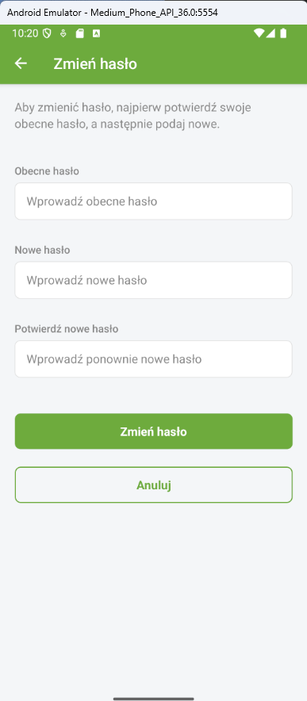
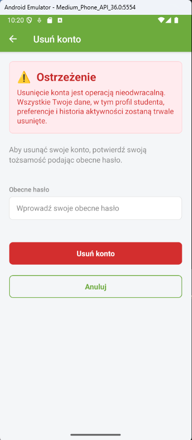
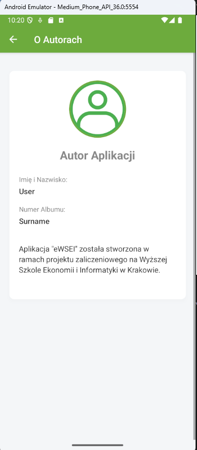

# 📱 eWSEI – React Native App

Aplikacja mobilna **eWSEI** dla studentów Wyższej Szkoły Ekonomii i Informatyki w Krakowie.

---

## 🟢 Platforma

- **Android**  
  _(testowana na urządzeniu klasy "Medium_Phone_API_36.0:5554")_

---

## ✨ Najważniejsze funkcje

- 🔒 **Rejestracja konta**  
  Tworzenie nowego konta studenta z walidacją adresu e-mail w domenie uczelni
- 🔑 **Logowanie i wylogowywanie**  
  Bezpieczne uwierzytelnianie użytkownika (Firebase Authentication)
- 📧 **Odzyskiwanie hasła**  
  Możliwość zresetowania hasła przez e-mail
- 🗃️ **Zapis i pobieranie danych użytkownika**  
  Dane profilu studenta (imię, nazwisko, numer albumu itp.) są zapisywane i pobierane z Firebase Firestore
- 🖼️ **Edycja profilu**  
  Zmiana danych osobowych oraz zdjęcia profilowego
- 🔄 **Zmiana hasła**  
  Bezpośrednio z poziomu aplikacji
- ❌ **Usuwanie konta**  
  Z potwierdzeniem i autoryzacją hasłem
- 🔄 **Przewijane ekrany**  
  Działa poprawnie zarówno w pionie, jak i w poziomie
- 🌍 **Wielojęzyczność**  
  Obsługa języka polskiego i angielskiego
- 🌗 **Motywy jasny/ciemny**  
  Automatyczne dopasowanie do preferencji systemu
- ☎️ **Kontakt z dziekanatem**  
  Szybkie przejście do sekcji Pomoc i Kontakt

---

## 🛠️ Technologie

- **React Native** (TypeScript)
- **Firebase Authentication** – logowanie, rejestracja, reset hasła, usuwanie konta
- **Firebase Firestore** – przechowywanie danych profilu użytkownika
- **Firebase Storage** – przechowywanie zdjęć profilowych
- **react-native-firebase** – integracja z Firebase
- **react-navigation** – nawigacja między ekranami
- **react-native-image-picker** – wybór zdjęcia profilowego z galerii
- **i18next** – tłumaczenia
- **Obsługa motywów i responsywności** – automatyczne przełączanie jasny/ciemny, wsparcie dla różnych rozdzielczości

---

## 📋 Wymagania

- **Android 8.0** lub nowszy
- Konto Firebase z odpowiednio skonfigurowanymi usługami Authentication, Firestore i Storage
- Plik `google-services.json` w katalogu `android/app`

---

## 🚀 Instalacja

git clone https://github.com/MiloszPradela/android-app
cd android-app
npm install

1. Skonfiguruj Firebase (`google-services.json` w `android/app`)
2. Uruchom aplikację na urządzeniu lub emulatorze:

---

## ✅ Testowane funkcje

- Rejestracja nowego użytkownika
- Logowanie i wylogowywanie
- Odzyskiwanie hasła przez e-mail
- Edycja profilu i zdjęcia
- Zmiana hasła i usuwanie konta
- Przewijanie i poprawne wyświetlanie w pionie i poziomie
- Przechowywanie danych w Firebase

---

## 🖼️ Zrzuty ekranu

---

## 📄 Licencja

Projekt edukacyjny, stworzony na potrzeby  studiów.

---

> **Aplikacja jest gotowa do dalszej rozbudowy i wdrożenia na Google Play.**
